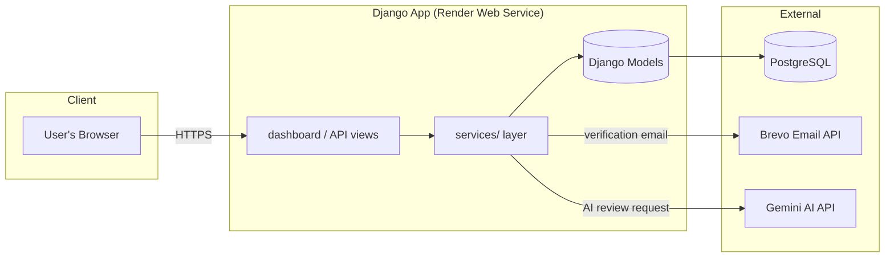
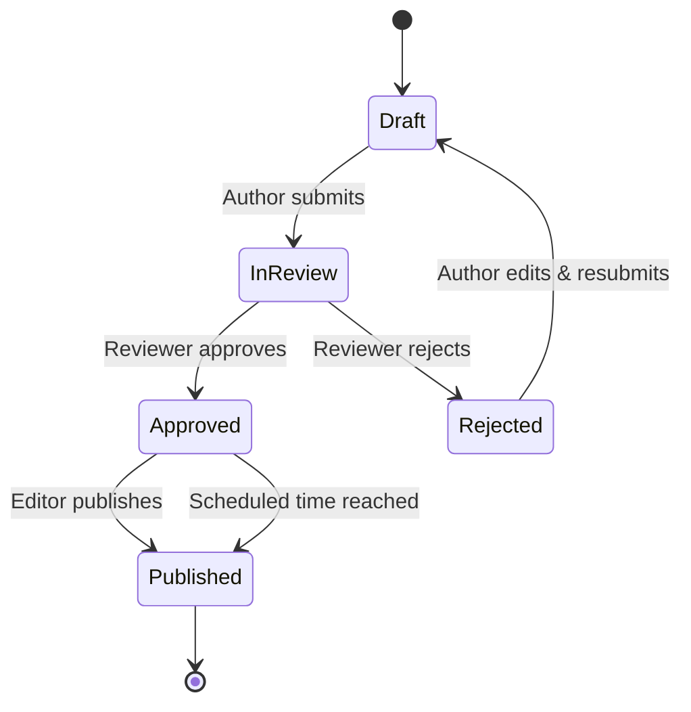
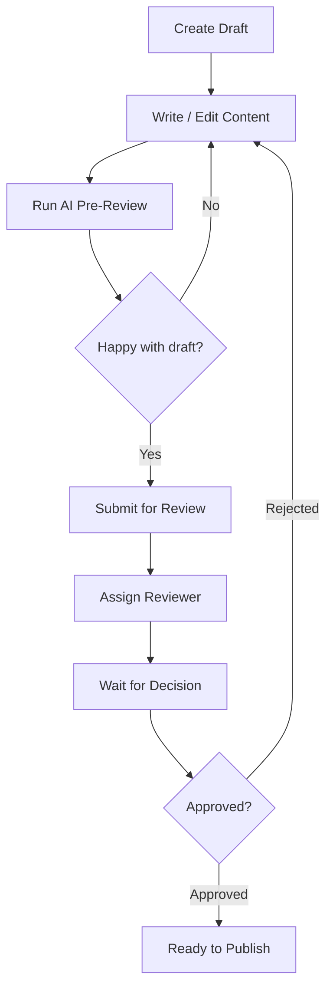
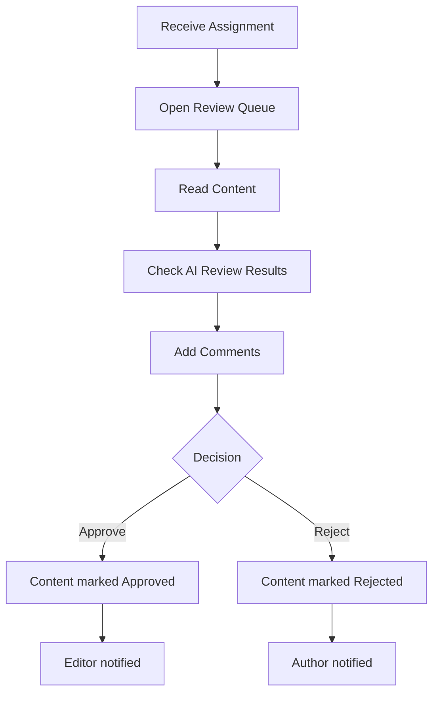
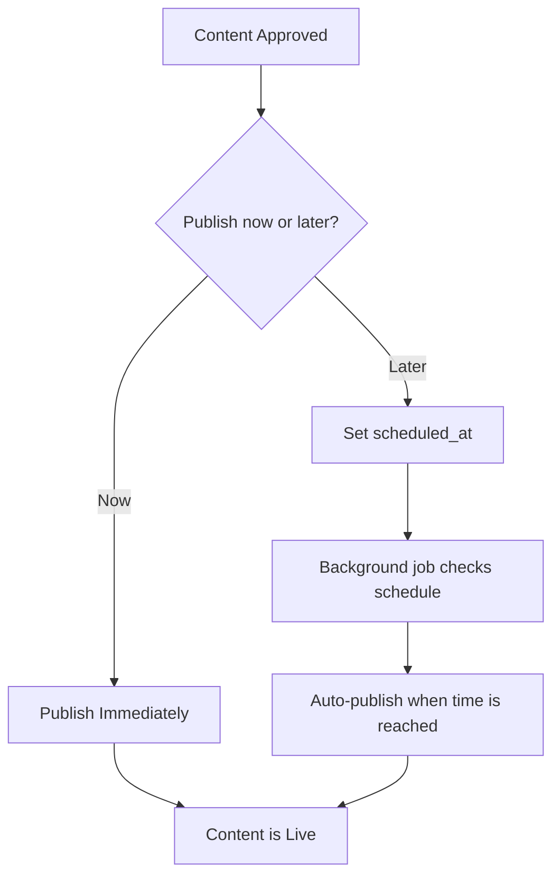
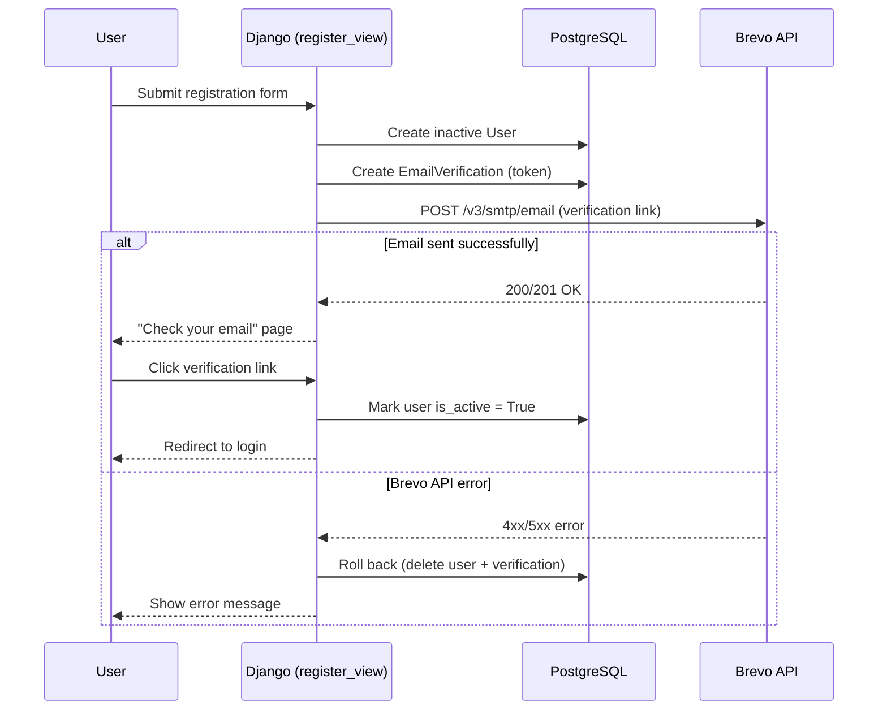

# CVDM — Content Version & Document Management

CVDM ("The Desk") is a Django-based platform for drafting, reviewing, and
publishing content with role-based workflows, full version history, AI-assisted
review, and audit logging.

---

## ✨ Core Features

- **Role-based access** — Author, Reviewer, Editor, Admin
- **Draft → Review → Approve → Publish** workflow
- **Full version history** with diffing and one-click restore
- **AI-assisted pre-review** (Gemini via `google-genai` / LangChain)
- **Scheduled publishing**
- **In-app notifications**
- **Audit trail** of every action
- **Email verification on signup** (via Brevo transactional email API)
- **REST API** (Django REST Framework, token + session auth)

---

## 🧱 Tech Stack

| Layer          | Technology                                   |
|----------------|-----------------------------------------------|
| Backend        | Django 6.1, Django REST Framework              |
| Database       | PostgreSQL (via `dj-database-url`)             |
| AI             | Google Gemini, LangChain, LangGraph            |
| Email          | Brevo Transactional Email API                  |
| Static files   | WhiteNoise                                     |
| Server         | Gunicorn                                       |
| Hosting        | Render                                         |

---

## 🏗️ System Overview



---

## 👥 Roles & Permissions

| Role         | Can Create | Can Review | Can Approve/Reject | Can Publish | Can Assign Reviewers |
|--------------|:----------:|:----------:|:-------------------:|:-----------:|:---------------------:|
| **Author**   | ✅         | ❌         | ❌                   | ❌          | ✅                     |
| **Reviewer** | ❌         | ✅         | ✅                   | ❌          | ❌                     |
| **Editor**   | ❌         | ❌         | ❌                   | ✅          | ✅                     |
| **Admin**    | ✅         | ✅         | ✅                   | ✅          | ✅                     |

> `Admin` is intentionally excluded from self-registration and must be
> assigned manually.

---

## 📄 Content Lifecycle

Every piece of content moves through a fixed set of statuses:



---

## ✍️ Author Workflow



---

## 🔍 Reviewer Workflow



---

## 🖊️ Editor Workflow



---

## 🔐 Registration & Email Verification



---

## 📁 Project Structure

```
CVDM_project/
├── accounts/          # Auth, email verification, Brevo integration
├── content/           # Content model & API
├── versions/          # Version history & diffing
├── workflow/          # Review assignments & comments
├── audit/             # Audit log
├── notifications/     # In-app notifications
├── ai_review/         # AI review results
├── dashboard/         # Server-rendered UI (views, templates, urls)
├── services/          # Business logic layer
│   ├── content/       # create/update/publish/schedule/diff
│   ├── ai/            # AI review orchestration
│   ├── workflow/      # reviewer assignment
│   ├── audit/         # audit logging helpers
│   └── notifications/ # notification dispatch
├── config/            # Django settings, urls, wsgi/asgi
├── requirements/       # Dependency pins
└── build.sh            # Render build script (install, collectstatic, migrate)
```

---

## ⚙️ Environment Variables

| Variable               | Purpose                                      |
|-------------------------|-----------------------------------------------|
| `SECRET_KEY`            | Django secret key                              |
| `DEBUG`                 | `True`/`False`                                 |
| `ALLOWED_HOSTS`         | Comma-separated list of allowed hosts          |
| `CSRF_TRUSTED_ORIGINS`  | Comma-separated list of trusted origins        |
| `RENDER_EXTERNAL_HOSTNAME` | Auto-set by Render; added to allowed hosts |
| `DATABASE_URL`          | PostgreSQL connection string                   |
| `GEMINI_API_KEY`        | Google Gemini API key for AI review            |
| `BREVO_API_KEY`         | Brevo transactional email API key              |
| `BREVO_SENDER_EMAIL`    | Verified Brevo sender email                    |
| `BREVO_SENDER_NAME`     | Display name for outgoing emails               |

---

## 🚀 Local Setup

```bash
# 1. Clone and enter the project
git clone https://github.com/palaksharmaIT/CVDM_project.git
cd CVDM_project

# 2. Create a virtual environment
python -m venv .venv
source .venv/bin/activate  # Windows: .venv\Scripts\activate

# 3. Install dependencies
pip install -r requirements/base.txt

# 4. Configure environment variables
cp .env.example .env   # then fill in the values

# 5. Run migrations
python manage.py migrate

# 6. Start the dev server
python manage.py runserver
```

---

## ☁️ Deployment (Render)

Render runs `build.sh` on every deploy:

```bash
pip install -r requirements/base.txt
python manage.py collectstatic --noinput
python manage.py migrate
```

The web service is started with:

```bash
gunicorn config.wsgi:application
```

> **Note:** Render's free tier blocks outbound SMTP ports (25/465/587),
> so transactional email is sent over HTTPS via the Brevo API rather than
> Django's SMTP email backend.

---

## 🗺️ Roadmap Ideas

- Version diff UI polish
- Reviewer workload dashboard
- Full-text search across content
- Tagging / categorization
- File & image attachments
- Export to PDF/DOCX
